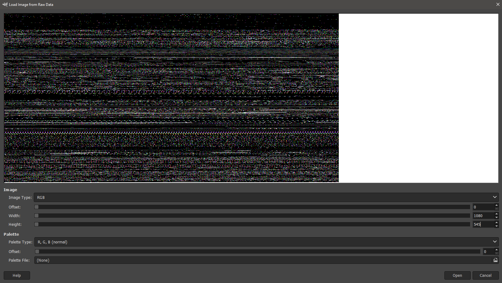

# Remote Password Manager \[fore, 347 points, 12 solves\]
The challenge provides us with a vmem file, and without any other rumination, I use volatility 2.6.1 on it. However, the tool was unable to recognize the image profile for the file.
After multiple failed attempts at the `imageinfo` command, I decided to clone the fresh repository of Volatility, and thankfully this time it was successful in identifying the image profile.

To identify the image profile for the given vmem:
```bash
$  ./vol.py -f ~/Downloads/pub/challenge.vmem imageinfo
```
Which gave back the required profile: Win10x64_18362

Now the next step was to identify all the processes that were running, for which I used pslist command:
```bash
$ ./vol.py -f ~/Downloads/pub/challenge.vmem --profile Win10x64_18362 pslist
Volatility Foundation Volatility Framework 2.6.1
Offset(V)          Name                    PID   PPID (...)
------------------ -------------------- ------ ------ (...)
0xffffe00d93088040 System                    4      0 (...)
0xffffe00d930d6080 Registry                136      4 (...)
(...)
0xffffe00d9af0f480 svchost.exe            4044    692 (...)
0xffffe00d9af57080 mstsc.exe              6484   3904 (...)
0xffffe00d9afd2080 svchost.exe            6832    692 (...)
0xffffe00d9b0693c0 WmiApSrv.exe           6928    692 (...)
0xffffe00d9ae87080 audiodg.exe            7792   1944 (...)
0xffffe00d9a24a4c0 MicrosoftEdgeC         8104    904 (...)
0xffffe00d9b6454c0 MicrosoftEdgeC         7636    904 (...)
0xffffe00d9b1c14c0 MicrosoftEdgeC         7532    904 (...)
0xffffe00d9340f080 cmd.exe                7420   2448 (...)
0xffffe00d930d0080 conhost.exe            8024   7420 (...)
```
Now keeping the challenge name and hint in mind, `mstct.exe` and `MicrosoftEdgeC` attrack attention. After a bit of googling, turns out mstsc.exe is in fact an RDP client,
and we can ignore the browser.
Dumping the memory for `mstsc.exe`:
```bash
./vol.py -f ~/Downloads/pub/challenge.vmem --profile Win10x64_18362 memdump -p 6484 --dump-dir dumpdir
```
We rename 6484.dmp to 6484.data, so that GIMP can process it, and opening it as raw data in GIMP.

Adjusting the offset values, we get the flag:


**flag:justCTF{7h3r3_15_n0_5uch_7h1n6_45_unh4ck4b13}**


